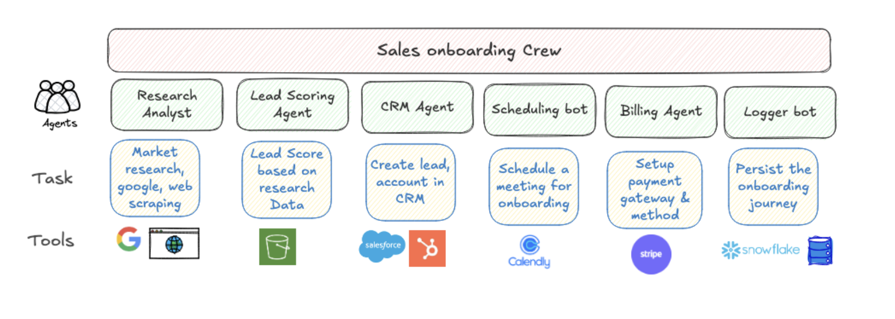

# AI-Powered Sales Onboarding Crew

An end-to-end automated sales onboarding workflow built using the crewAI agentic framework.

This system uses specialized AI agents to handle lead research, enrichment, scoring, CRM setup, billing, scheduling, logging, and notifications — all orchestrated in a structured, modular flow.



---

## Features

- Lead research and enrichment via Serper and web scraping
- Lead scoring based on business attributes (employees, revenue, etc.)
- Salesforce integration for automated account creation
- Stripe customer setup and checkout session generation
- Personalized Calendly scheduling link generation
- Snowflake logging of final structured onboarding data
- Email notification using SendGrid or SMTP

---

## Tech Stack

- Python 3.x
- CrewAI (agent orchestration)
- Pydantic (structured schema validation)
- Salesforce API
- Stripe API
- Calendly prefilled links
- Snowflake (cloud data warehouse)

---

## How It Works

Each agent in the crew is configured with:
- A defined role and backstory
- One or more tools (custom or CrewAI-compatible)
- A task that processes structured input and produces structured output

The agents work sequentially (or concurrently if configured), passing validated data between each stage using CrewAI's task context.

---

## Project Setup
1. Install dependencies:
```
    python3 -m venv .venv
    source .venv/bin/activate
    curl -LsSf https://astral.sh/uv/install.sh | sh
    pip install --upgrade pip
    uv pip install -r requirements.txt
 
```

3. Configure environment variables in a .env file:

```
SERPER_API_KEY=
OPENAI_API_KEY=
SNOWFLAKE_USER=
SNOWFLAKE_PASSWORD=
SNOWFLAKE_ACCOUNT=
SNOWFLAKE_WAREHOUSE=
SNOWFLAKE_DATABASE=
SNOWFLAKE_SCHEMA=
SF_ACCESS_TOKEN=
SF_INSTANCE_URL=
SF_DOMAIN=
STRIPE_SECRET_KEY=
```

